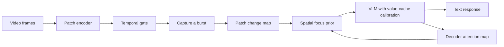

# How FOCUS works

FOCUS combines adaptive temporal gating with a spatial prior carried between VLM
responses. The Python package is `focus`. The gate and feedback are separate:
enabling feedback must not change which frames the gate selects.



## 1. Temporal gating

For each incoming frame, compare its patch embeddings with the immediately
preceding processed frame:

```text
d[i] = 1 - cosine(current_patch[i], previous_patch[i])
D = mean(d)
```

The reference updates on every processed frame, including skipped frames. The
paper uses patch mode and the mean score. Frame-reference mode and max/ratio
aggregation remain available as optional variants.

Start in `CAPTURE` and retain a burst of `B` consecutive frames. Then enter
`WATCH`; a score above `threshold` or a wait of `max_gate_frames` starts another
burst. The triggering frame belongs to the new burst. A final incomplete burst
is processed at end of input. See [gating.py](../src/focus/gating.py).

## 2. Spatial focus

Reshape patch dissimilarities into the encoder's spatial grid and accumulate the
elementwise maximum across retained frames. Normalize this map to `[0, 1]` and
combine it with the previous response's normalized attention map:

```text
C = normalize(motion * (0.01 + attention ** 0.5))
```

Resize the attention map when grids differ. Constant maps normalize to zeros.
The first burst has no attention prior, so it runs without calibration. Clearing
the next burst's motion accumulator preserves the attention prior. See
[spatial.py](../src/focus/vlm/spatial.py).

## 3. Value-cache calibration

The spatial prior is mapped to image-token positions in the decoder input.
For each token with prior `c`, compute a scale once before generation:

```text
inside focus_range: scale = 1 + (focus_alpha - 1) * c
outside focus_range: scale = max(0.5, 1 - focus_suppress * (1 - c))
```

At each single-token decode step, multiply cached vision-token **values** by
this scale. Keys and text-token values remain unchanged. Values remain in the
cache, so the effect compounds over decoding steps. Prefill is excluded and
hooks are removed when generation finishes, including on failure. This retains
all tokens; it is not token pruning. See
[focus.py](../src/focus/vlm/focus.py).

## 4. Attention feedback

An additional forward pass supplies decoder attention. The extractor max-pools
attention across heads, averages the last four layers, and selects text-to-image
attention. Post-image text rows are weighted by their total attention to image
tokens. Scores are folded into spatial grids and normalized for the next burst.

**Implementation boundary:** the inherited Qwen adapters extract feedback from
the middle frame of each burst with the generated response as text. The paper
describes a teacher-forced pass over the original multi-frame prompt plus
response. These are different attention measurements; this release does not
claim they are equivalent. The adapter boundary makes this behavior explicit
for replacement backbones. See [attention.py](../src/focus/vlm/attention.py)
and [the VLM integration guide](new_vlm.md).

## Parameters

The evaluation commands use the following FOCUS settings. Library defaults and
demo options are configurable; pass explicit values when comparing experiments.

| Parameter | Evaluation value | Meaning |
|---|---:|---|
| `threshold` | 0.4 | Mean patch dissimilarity needed to trigger |
| `burst_size` | 32 | Consecutive retained frames per call |
| `max_gate_frames` | 300 | Maximum wait before another capture |
| `focus_alpha` | 1.05 | Per-step amplification strength |
| `focus_range` | 0.75–1.0 | Prior values receiving amplification |
| `focus_suppress` | 0.04 | Decay outside the selected range |
| Fusion exponent | 0.5 | Attention-map exponent |
| Fusion floor | 0.01 | Prevents attention alone from zeroing nonzero motion |
| Attention layers | Last 4 | Layers used to form feedback |

Timing depends on input sampling, resolution, generation length, and attention
extraction. An invocation count alone does not measure total compute. See
[benchmark protocols and limitations](benchmarks.md).
